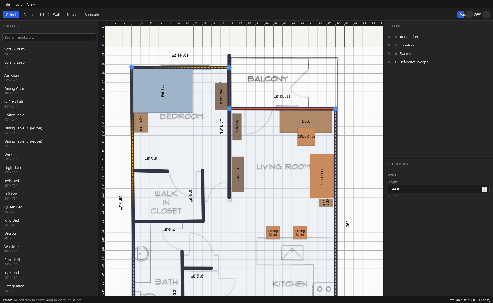

# Mover

A free, open source 2D home layout planner that runs entirely in the browser. Draw rooms, place furniture, and overlay scaled reference images. No account, no server, no cost.

Try it live: https://n-onorato.github.io/mover/



## Requirements

- Node.js 20.19+ or 22.12+
- npm

## Setup

```bash
cd app
npm install
npm run dev
```

This starts a local dev server (Vite will print the URL, typically `http://localhost:5173`). Open it in a browser.

## Other commands

Run from the `app` directory:

```bash
npm run build    # type-check and build for production
npm run test     # run the test suite
npm run lint     # lint the codebase
npm run preview  # preview a production build locally
```

## Project layout

- `app/` - the application source (React, TypeScript, Vite, Konva)
- `specs/` - design and requirements documentation; start with [specs/overview.md](specs/overview.md)

Projects are saved and loaded as local `.mover.json` files. There is no server component and no data leaves the browser.
